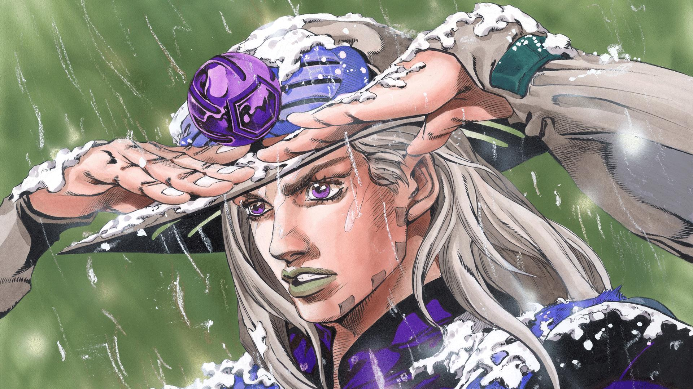

<div align="center">
  
  

  # ⚡ Luiz Santarosa

  **`Robotics Engineer | ROS2 Developer | Stand User`**

  [](https://www.linkedin.com/in/luiz-santarosa/)
  [](https://www.instagram.com/luiz_santarosa/)
  [](mailto:Luizgustavo.santarosa@gmail.com)

</div>

---


### 🤖 About Me

```yaml
name: Luiz Gustavo Santarosa
role: Robotics & University researcher
education: BSc Information Systems — PUCPR
location: Curitiba, PR — Brazil
```

- 🦾 Working daily with **ROS2** — nodes, topics, services, actions, launch files
- 🐍 Python as my main weapon for robot control, scripting and automation
- 🔭 Exploring **autonomous navigation, SLAM & computer vision**
- 🌐 Web dev background — building dashboards and robot interfaces
- 🧠 Always learning, always building
- 💬 Ask me about **ROS2, robotics, Python** or anything tech!

<br clear="right"/>

---

### 🛠️ Tech Stack

<div align="center">

#### 🤖 Robotics & Core


#### 🌐 Web & Interfaces


</div>

---

<div align="center">
  
  *"This is the path I chose. I don't regret it."*
  
  

</div>
